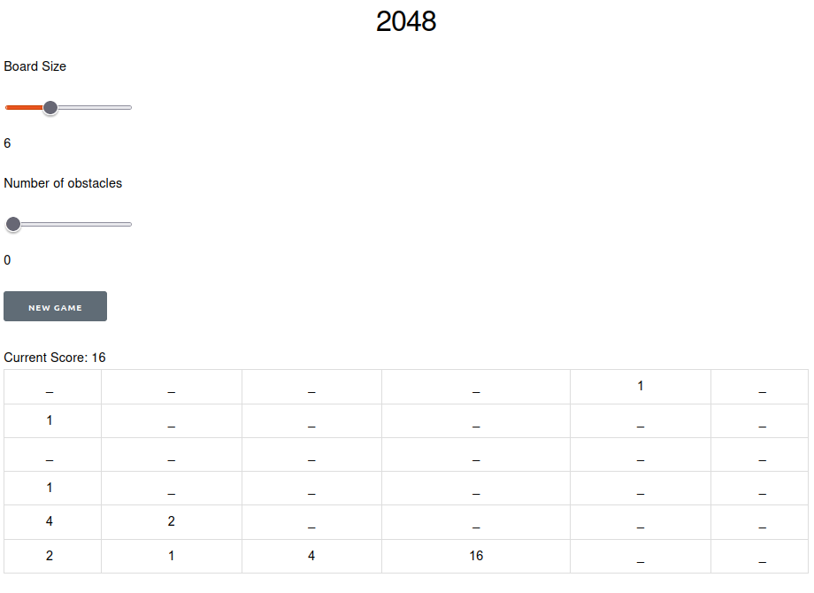

# Game 2048

My implementation of the game [2048](https://play2048.co/) in Elixir. 

Tiles move up, down, left and right controlled by the arrow keys. When two tiles with the same number touch, their scores are added together and they merge into one.

This implementation has a configurable board size. It also has an optional obstacles feature.

Please excuse the dreadful front end.



## Run locally

- Install [Elixir](https://elixir-lang.org/install.html)
- Fetch dependencies:

```bash
mix deps.get
```

- Run server:

```bash
mix phx.server
```

- Navigate to endpoint: http://localhost:4000/game2048

- Play using the arrow keys to move tiles up, down, left and right.

## Tests

```bash
mix test
```
